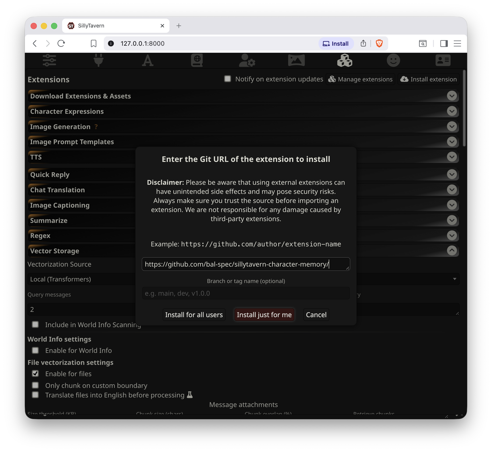
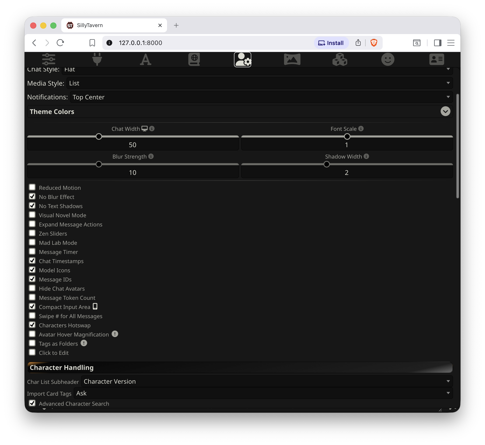
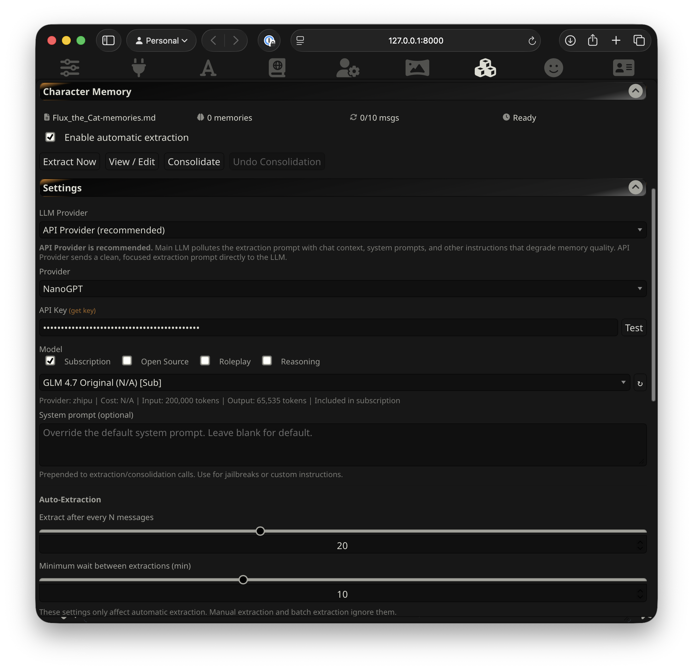
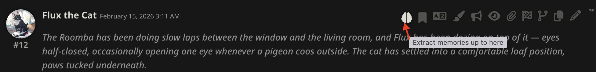
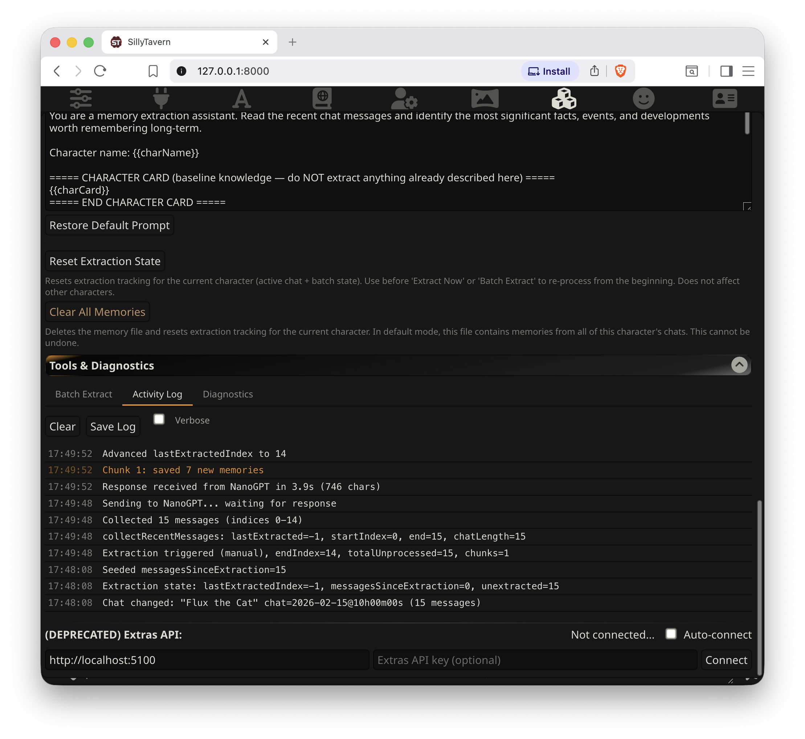
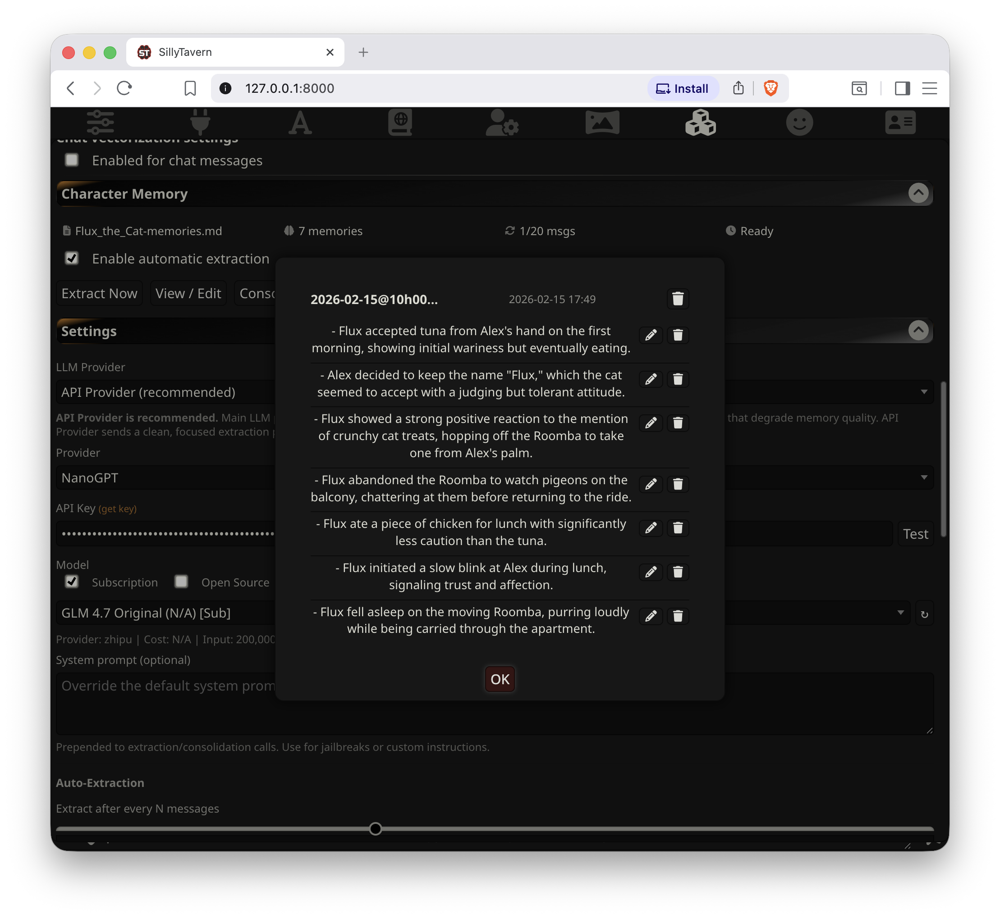
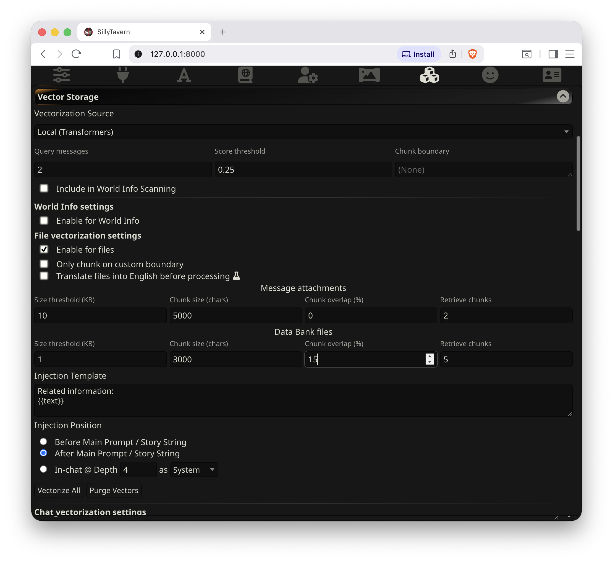

# CharMemory — SillyTavern Extension

This extension automatically extracts structured character memories from chat and stores them in the character's Data Bank. Memories are vectorized by SillyTavern's Vector Storage so the most relevant ones are retrieved at generation time — your character remembers things from old conversations.


## What CharMemory Does

When you chat with a character in SillyTavern, the conversation disappears from the LLM's context as it scrolls past the token limit. CharMemory solves this by automatically extracting important facts, events, and developments from your chats and storing them as structured memories.

Memories are stored as plain markdown files in the character's **Data Bank** — SillyTavern's built-in file attachment system. You can view, edit, or delete the memory file at any time, either through CharMemory's Memory Manager or by editing the Data Bank file directly.

These memory files are then vectorized by **Vector Storage** (a standard extension that ships with SillyTavern) so that the most relevant memories are automatically retrieved and injected into the LLM's context at generation time.

### Feature Overview

- **Automatic**: Extracts memories every N character messages/turns (configurable with cooldown for rapid-fire conversations)
- **Chunked**: Loops through all unprocessed messages in chunks to prevent overwhelming the LLM's context window
- **Batch extraction**: Extract memories from all (or selected) chats for a character, not just the active one
- **Visible**: Memories stored as a plain markdown file in character Data Bank — fully viewable and editable
- **Per-bullet management**: Browse, edit, or delete individual memory bullets from the Memory Manager
- **Consolidation**: Merge duplicate and related memories with preview before applying and one-click undo
- **Scoped**: Memories are per-character by default, with optional per-chat isolation
- **Non-destructive**: Only appends, never overwrites existing memories
- **Multiple LLM sources**: Dedicated connection to an LLM provider via API (recommended), WebLLM (browser-local), or the Main LLM provider in use for the chat
- **Memory/Lorebook diagnostics**: Shows you exactly what the LLM saw during its last generation to help debug memories and lorebook entries not showing up/triggering

---

## Before You Start — Back Up Your Data

CharMemory writes to your character's Data Bank files. If you already have memory files, character notes, or other Data Bank attachments you care about, **back them up first**.

To back up: open SillyTavern → click a character → open their **Data Bank** (paperclip icon) → download any files under Character Attachments.

Operations like **Clear All Memories** and **Consolidation** modify or delete memory files and cannot always be undone. A backup takes seconds and protects hours of accumulated memories.

---

## Quick Start

You need a working SillyTavern installation and an API key for any supported LLM provider.

**1. Install the extension**
Open SillyTavern → click the **Extensions** icon (puzzle piece) → **Install extension** → paste this URL → click **Install just for me**:
```
https://github.com/bal-spec/sillytavern-character-memory
```

**2. Set up the extraction LLM**
Scroll down in Extensions to find **Character Memory** → expand **Settings** → under **Provider**, pick one (e.g., OpenRouter, NanoGPT, Groq — any provider with an OpenAI-compatible API works) → enter your **API Key** → click **Connect** to fetch models → select a **Model** from the dropdown → click **Test Model** to verify it works.

Not sure which model? **GLM 4.7** and **DeepSeek V3.1** are good starting points.

**3. Enable Vector Storage**
Still in Extensions, find **Vector Storage** → set Vectorization Source to **Local (Transformers)** → under **File vectorization settings**, check **Enable for files**. This is what makes your character actually *use* the extracted memories during chat.

**4. Chat**
Chat normally with any character. After 20 character messages, memories are extracted automatically. Click **View / Edit** in the CharMemory panel to see what was captured.

That's it — you're up and running. Everything below covers the details: what the extension does, how to tune it, recommended settings, and troubleshooting.

---

## Full Setup Guide

This section walks through each step in detail with screenshots. If you already followed the Quick Start above and everything's working, you can skip ahead to [Per-Message Buttons](#per-message-buttons) or [Understanding the Extraction Settings](#understanding-the-extraction-settings).

### Prerequisites

- A working SillyTavern installation
- If you are using a hosted LLM provider you will need an API key. If you're using the same provider as your chat (not recommended) then this is already configured. If you're using WebLLM it is not needed

### Step 1: Install the Extension

1. Open SillyTavern in your browser
2. Click the **Extensions** icon (puzzle piece) in the top navigation bar
3. Click **Install extension** in the top-right corner of the Extensions panel
4. Paste the GitHub URL:
   ```
   https://github.com/bal-spec/sillytavern-character-memory
   ```
5. Click **Install just for me** and wait for the installation to complete



6. Scroll down in the Extensions panel — you should see **Character Memory** at the bottom

### Recommended: Turn on Chat Timestamps and Message IDs

Before you start chatting, enable these two options in SillyTavern's User Settings. They're not required, but they make CharMemory much easier to work with:

- **Chat Timestamps** — shows when each message was sent. Useful for correlating messages with extraction dates in the memory file.
- **Message IDs** — shows a sequential number on each message. The Activity Log references message indices (e.g., "Collected 15 messages (indices 0-14)"), the "Extract Here" button processes up to a specific index, and Diagnostics show `lastExtractedIndex` so you can see exactly which messages have been processed.

To enable: click the **User Settings** icon (the person silhouette at the top) → scroll to the checkboxes in the UI section → check **Chat Timestamps** and **Message IDs**.



### Step 2: Choose an Extraction Provider

CharMemory needs an LLM to read your chat messages and extract memories from them. This is a separate LLM call from your main chat. Open the **Settings** section inside the CharMemory panel.

You have three options for **LLM Used for Extraction**:

| Option | How it works | Best for |
|--------|-------------|----------|
| **Dedicated API** (recommended) | Sends a clean extraction request directly to an API | Best extraction quality — the extraction prompt isn't polluted by chat prompt |
| **WebLLM** | Runs a small model locally in your browser | Privacy and no API cost, but limited quality |
| **Main LLM** | Uses whatever LLM you're chatting with | No extra setup, but extraction quality suffers because the prompt gets mixed with chat system prompts and instructions |

#### Setting up Dedicated API

Dedicated API is the default and recommended option. It sends *only* the extraction prompt to the LLM — no chat system prompts, jailbreaks, persona instructions, or other context gets mixed in. (The extraction prompt itself includes the character card as a bounded reference section so the LLM knows what not to re-extract — but that's intentional and controlled, unlike Main LLM where everything piles up.) This produces noticeably better memories.

1. Open **Settings** in the CharMemory panel — **Dedicated API** is already selected
2. Choose a **Provider** from the dropdown. Options include OpenAI, Anthropic, OpenRouter, Groq, DeepSeek, Mistral, NanoGPT, NVIDIA, Ollama, and others.
3. Enter your **API Key** for that provider
4. Click **Connect** to fetch the list of available models
5. Select a **Model** from the dropdown
6. Click **Test Model** to verify the model responds correctly



If your provider isn't listed, select **Custom** from the Provider dropdown. You can enter any OpenAI-compatible API base URL and it will work as long as the endpoint supports the `/chat/completions` format. Most LLM providers use this standard.

**Note on NVIDIA**: NVIDIA's API doesn't support CORS (browser-to-API requests), so CharMemory automatically routes NVIDIA requests through SillyTavern's server. This happens transparently — no extra setup is needed, just select NVIDIA, enter your API key, and go. Your API key is passed securely via headers and never touches SillyTavern's own configuration.

If you're not sure which model to use, see the [Recommended Models](#recommended-models) section below.

### Step 3: Chat Normally

That's it for basic setup. Now just chat with a character as you normally would.

As you chat, open the extension to watch the **stats bar** at the top of the CharMemory panel. You'll see the extraction progress counter tick up with each character message (e.g., "5/20 msgs"). When the counter reaches the threshold (default: 20 messages), CharMemory will automatically extract memories from the conversation.


#### What the Stats Bar Shows

- **File name**: The memory file for the current character (e.g., `Flux_the_Cat-memories.md`). This is auto-generated from the character name, but you can set a custom name in Settings → Storage → File name override.
- **Memory count**: Total individual memory bullets stored
- **Progress**: Messages since last extraction vs. the auto-extract threshold (e.g., "1/20 msgs")
- **Status**: "Ready" when extraction can fire, or a cooldown timer

#### Your First Extraction

You don't have to wait for the auto-extraction threshold. There are two ways to extract right away:

1. **Extract Now** (button at the top of the CharMemory panel) processes all unprocessed messages in the entire chat. Click it, and you'll see a toast notification with how many memories were saved.

2. **Extract Here** (brain icon on any character message) processes all unprocessed messages up to and including that specific message. This is useful when you want to extract from a particular point in the conversation without processing everything after it.



You can follow either extraction in real time in the **Activity Log** (Tools & Diagnostics → Activity Log). It shows each step: messages collected, LLM call sent, response received, and memories saved.



### Step 4: View Your Memories

Click **View / Edit** to open the Memory Manager. Your extracted memories appear as cards grouped by extraction, showing the chat name and timestamp. Each bullet has its own edit and delete buttons.



You can **edit** any bullet to refine its wording, or **delete** bullets that aren't useful. If a block becomes empty after deleting all its bullets, it's removed entirely.

Since memories are stored as a plain markdown file in the character's Data Bank, you can also edit the file directly if you prefer. Open the character's Data Bank panel (the paperclip icon), find the memory file, and edit it in any text editor. The Memory Manager is simply a more convenient interface for the same file.

### Step 5: Set Up Vector Storage

Extracting memories is only half the story. For your character to actually *use* those memories during conversation, you need **Vector Storage** enabled.

Vector Storage is a standard extension that ships with every SillyTavern installation — you don't need to install anything extra. It converts memories into embeddings (numerical representations) and retrieves the most relevant ones when the character generates a response.

Without Vector Storage enabled for Data Bank files, memories are stored but never injected into the LLM's context — the character won't recall them.

#### Enable Vector Storage

1. In the **Extensions** panel, find **Vector Storage** and expand it
2. Choose a **Vectorization Source**. The simplest option is **Local (Transformers)** — runs in your browser, no API key needed. Local vectorization is perfectly adequate for CharMemory (see note below).
3. Under **File vectorization settings**, check **Enable for files** — this is the critical setting. CharMemory stores memories as Data Bank files, so this must be on.
4. Configure the **Data Bank files** settings as shown below



#### Recommended Vector Storage Settings

The Vector Storage panel has two rows of file settings: **Message attachments** (top) and **Data Bank files** (bottom). CharMemory uses the Data Bank, so focus on the bottom row:

| Setting | Recommended | Why |
|---------|-------------|-----|
| **Size threshold** | 1 KB | Controls when chunking kicks in. Below this size, the whole file gets one embedding. At 1 KB (~5-10 memory bullets), individual chunks start getting their own vectors so Vector Storage can retrieve *specific* relevant memories instead of the whole file as a blob. |
| **Chunk size** | 3000 chars | A `<memory>` block with 8 bullets is roughly 500-1500 chars. 3000 keeps 1-2 full blocks per chunk without splitting them mid-sentence. Too small and blocks get cut in half. Too large and you lose retrieval granularity. |
| **Chunk overlap** | 15% | ~450 chars of overlap at 3000 chunk size. Catches memory blocks that straddle a chunk boundary. Without overlap, a block landing exactly on the split gets half in one chunk and half in another, making neither retrievable cleanly. |
| **Retrieve chunks** | 5 | How many memory chunks are retrieved per generation. At ~2 blocks per chunk, that's roughly 10 memory blocks — enough context without flooding the prompt. Going too high (20+) effectively dumps the whole file, defeating the purpose of semantic search. |

#### Why Local Vectorization Is Fine

You might wonder whether a local embedding model is "good enough" compared to hosted options like OpenAI's embeddings. For CharMemory, it absolutely is.

Embedding is a much simpler task than generation — you're not asking the model to reason or follow instructions, just to measure how semantically similar two pieces of text are. Even small models do this well. For a typical CharMemory use case (dozens to low hundreds of memory bullets per character), the semantic gaps between relevant and irrelevant memories are wide enough that any reasonable embedding model catches them.

Hosted embedding models (OpenAI `text-embedding-3-small`, Cohere `embed-v3`, etc.) produce marginally better embeddings for subtle semantic distinctions, multilingual content, or very large corpora — but for matching "Flux gave Alex a slow blink" against a conversation about the cat's trust level, a local model works perfectly. The retrieval quality bottleneck is almost always the memory *content* quality, not the embedding model.

Local also has practical advantages: no API key, no cost, no rate limits, no privacy concerns (your memories never leave your machine), and no network latency per embedding call.

#### Verify It's Working

After extracting some memories and chatting further, use the [Diagnostics](#using-diagnostics) tab to verify memories are being vectorized and injected. See the Diagnostics section below for details.

---

## Per-Message Buttons

Each message in your chat has two extra buttons (visible when you hover over the message):

1. **Extract Here** (brain icon, character messages only)
Runs LLM-based extraction on all unprocessed messages up to and including this one. Useful for targeting a specific point in a long conversation. Uses the same provider and settings as auto-extraction.

2. **Pin as Memory** (bookmark icon, all messages)
Manually saves a message as a memory with no LLM involved. Opens an edit dialog pre-filled with the message text so you can rewrite it however you want before saving. Each line becomes a memory bullet. Use this when you want to remember something specific exactly as you phrase it.

---

## Other Features

### Batch Extraction

If you have existing chats with a character, you don't need to manually extract each one. Batch extraction processes multiple chats at once:

1. Open **Tools & Diagnostics** → **Batch Extract** tab
2. Click **Refresh** to load the list of chats for the current character
3. Select the chats you want to extract (use **Select All** to check all of them)
4. Click **Extract Selected** — a confirmation popup shows the total message count
5. Progress updates show which chat is being processed and chunk progress
6. Use **Stop** to cancel mid-extraction — progress is saved per-chunk, so you won't lose work

Each chat's extraction state is tracked separately. Re-running batch extraction only processes new messages since the last run — it won't re-extract messages that have already been processed.

#### Expectations for Long Existing Chats

Batch extraction works best for catching up on recent unprocessed chats. For very long existing chats (hundreds of turns), results may be sparser than you'd expect. This is by design — the LLM only sees one chunk at a time and can't assess significance across the full conversation arc the way it can when extracting incrementally as you chat.

CharMemory works best when it extracts **as you go** — each extraction builds on the previous memories, and the LLM has both the existing memories and the current chunk to work with. When starting fresh on a very long chat, the early chunks have no existing memories for context, so the LLM may miss details that only become significant later.

If batch extraction of a long chat produces too few memories, try:
- **Increasing "Messages per LLM call"** — giving the LLM a bigger window (40–50 messages) helps it identify more significant events per chunk
- **Running consolidation after extraction** — this can merge and refine the sparse results
- **Starting a new chat with the character** — incremental extraction as you chat naturally produces the best results over time

### Resetting Extraction State

Two reset options are available in Settings:

**Reset Extraction State** resets the extraction tracking for the current character — both the active chat and all batch extraction state. After resetting, the extension treats all messages as unprocessed. This is useful when you want to re-extract from the beginning, perhaps after changing the extraction prompt or switching to a better model. It does **not** delete any memories.

**Clear All Memories** deletes the memory file and resets all extraction tracking. In default mode (not per-chat), the memory file contains memories from **all** of that character's chats, so this clears everything. This cannot be undone.

### Consolidation

When the memory file grows large with many extraction blocks, related or duplicate memories can accumulate across different sessions. The **Consolidate** button sends the full memory file to the LLM with instructions to deduplicate and combine related entries.

Consolidation is always manual — it never runs automatically. Before any changes are applied:

1. A **before/after preview** shows you exactly what will change
2. You must **confirm** before anything is written
3. **Undo Consolidation** restores the previous version if the result isn't satisfactory

**Back up your memory file before consolidating**, especially if you have a large number of memories. The undo is session-only — if you close SillyTavern, the backup is lost. To back up: open the character's Data Bank (paperclip icon) and download the memory file.

Results vary depending on the model used and the size of the memory file. Review the preview carefully before applying.

### Per-Chat Memories

By default, all chats for a character share one memory file. Enable **Separate memories per chat** in Settings → Storage to give each conversation its own file. This is useful when the same character appears in different scenarios or timelines that shouldn't share context.

### Custom File Names

The memory file is auto-named from the character name (e.g., `Flux_the_Cat-memories.md`). You can override this in Settings → Storage → **File name override**. This is useful if you want a more descriptive name or if you're managing multiple memory files manually.

### Slash Commands

| Command | Description |
|---------|-------------|
| `/extract-memories` | Force extraction regardless of interval |
| `/consolidate-memories` | Consolidate memories by merging duplicates |
| `/charmemory-debug` | Capture diagnostics and dump to console |

---

## Using Diagnostics

The **Diagnostics** tab (Tools & Diagnostics → Diagnostics) shows you exactly what the LLM saw during its last generation. This is the single best tool for answering "why isn't my character remembering X?" or "what memories are actually being used?"

Click **Refresh** after generating a message to capture the current state.


### What Diagnostics Shows

**Memories** — The active memory file name, whether it exists in the Data Bank, total memory count (bullets and blocks), and vectorization status (including chunk count and embedding source). This tells you whether your memories are stored and indexed correctly.

**Injected Memories — Last Generation** — The specific memory bullets that Vector Storage retrieved and sent to the LLM for the most recent generation. This is the most important section — it shows you exactly which memories the character had access to when it wrote its last response. If a memory exists in the file but doesn't appear here, it either wasn't semantically relevant to the current conversation or Vector Storage settings need adjustment.

**Character Lorebooks** — A static list of all World Info / lorebook books bound to the current character, with entry counts and trigger keys. This appears in diagnostics because lorebook entries and memories both get injected into the LLM's context, and they can interact — a lorebook entry might provide world-building context that complements a memory, or they might conflict. Seeing both in one place helps you understand the full picture of what supplemental context the character has.

**Activated Entries — Last Generation** — Which specific lorebook entries actually fired during the last generation, based on their trigger keys matching the conversation. Unlike the static list above, this shows what was *actually injected* — so you can see if a lorebook entry you expected to fire didn't, or if unexpected entries are crowding out memory context.

**Extension Prompts** — All content injected by extensions (including Vector Storage's memory retrieval and any other active extensions). This is the raw view of everything beyond the base conversation that the LLM received.

### Why Memories and Lorebooks Both Appear

CharMemory's diagnostics shows both memories and lorebooks because they're the two main sources of supplemental character context that get injected alongside the conversation. When debugging "the character doesn't remember X" or "the character is acting strangely," the answer often involves the interaction between these sources — not just one in isolation. The diagnostics panel gives you a single place to inspect everything the LLM saw beyond the chat messages themselves.

---

## Understanding the Extraction Settings

Once you're up and running, you may want to tune how often and how extraction happens. Open **Settings** in the CharMemory panel.

### Auto-Extraction Timing

Two sliders control when automatic extraction fires:

**Extract after every N messages** (default: 20, range: 3–100)
How many character messages must arrive before auto-extraction triggers. A higher value gives the LLM more context per extraction, which generally produces better, more selective memories. A lower value extracts more frequently with less context.

**Minimum wait between extractions** (default: 10 min, range: 0–30 min)
A cooldown that prevents rapid-fire extractions during fast-paced chats. When the message threshold is reached, extraction only fires if this much wall-clock time has passed since the last one. If the cooldown hasn't expired, extraction is skipped (not queued) and checks again on each subsequent message. Messages keep accumulating during the cooldown, so when it finally fires, it processes everything that piled up.

These two settings **only affect automatic extraction**. Manual "Extract Now", per-message "Extract Here", and batch extraction always run immediately.

### Extraction Quality

**Messages per LLM call** (default: 20, range: 10–200)
Controls how many messages are sent to the LLM in a single extraction call. If there are more unprocessed messages than this, extraction loops through them in chunks. Larger chunks give the LLM more context per call and can produce better memories, but too many messages can cause timeouts with some providers.

In the common auto-extraction case, only N messages (the interval threshold) will have accumulated, so this slider is irrelevant — the chunk size only kicks in when messages pile up beyond the interval, during manual extraction of long chats, or during batch extraction.

The right value depends on your chat style. If your character writes long, detailed responses, 20 messages might already be a lot of text. If both sides write short messages, you may want to increase this to 40–50 so the LLM has enough context to judge what's significant. The test is to look at the memories it creates — if they're too granular (trivial details), increase this. If extractions are timing out, decrease it.

You can check your memories either using the **View/Edit** button in the extension panel, or by going to the character's Data Bank (magic wand icon → Open Data Bank → Character Attachments) and clicking the pencil icon on the memory file.

Setting this too low (e.g., 10) gives the LLM too little context — it extracts trivial details because there isn't enough conversation to judge what's significant. Setting it too high (150+) doesn't improve quality, increases token costs, and may cause timeouts with some providers.

**Max response length** (default: 1000 tokens, range: 100–4000)
Token limit for the LLM's response per chunk. Most models produce well-formed output within 1000 tokens. **Reasoning/thinking models** (like GLM-4.7 on NVIDIA) need significantly more — their internal reasoning consumes tokens before producing the actual output. If you're using a thinking model and getting empty extractions, increase this to 2000–3000.

### How the Settings Interact

The three main sliders — **Extract after every N messages** (interval), **Minimum wait between extractions** (cooldown), and **Messages per LLM call** (chunk size) — work together:

**Interval and chunk size.** The extension tracks a `lastExtractedIndex` watermark. Each message is only ever sent to the LLM once — there is no overlap between extractions. When auto-extraction fires after N messages, only those N unprocessed messages are sent, even if the chunk size is larger. This means that with the defaults (interval=20, chunk size=20), each auto-extraction sends exactly 20 messages to the LLM. The chunk size only becomes relevant when more messages accumulate than the interval — for example, during manual "Extract Now" after a long chat, batch extraction, or when the cooldown delayed auto-extraction and messages piled up.

**Why the interval matters for quality.** A higher interval gives the LLM more messages per extraction, which means more context to judge what's significant. With only 10 messages, the LLM has little to work with and may extract minor details. With 20–50 messages, it can better identify meaningful developments and skip filler.

**How cooldown works.** When the message counter hits the interval threshold, the extension checks whether enough wall-clock time has passed since the last extraction. If not, extraction is **skipped** (not queued). The counter stays above the threshold, so it checks again on each subsequent message until the cooldown expires. During this time, messages keep accumulating. When extraction finally fires, it processes everything that piled up — potentially sending more than N messages and using the chunk size to split them into multiple LLM calls.

**Practical examples:**
- *Fast chat, defaults (interval=20, cooldown=10min):* 20 messages arrive in 3 minutes. Extraction wants to fire but cooldown blocks it. By the time 10 minutes pass, 60 messages have accumulated. Extraction fires and processes all 60 in three chunks of 20.
- *Leisurely chat, defaults:* 20 messages arrive over 45 minutes. Cooldown is long expired. Extraction fires immediately and processes 20 messages in one call. The chunk size is irrelevant.
- *High interval (interval=50, cooldown=0):* Extraction fires every 50 messages with no time gate. Each extraction has rich context and produces higher-quality, more selective memories.

---

## The Extraction Prompt

The extraction prompt is the core of what makes CharMemory produce useful memories rather than a play-by-play transcript. You can view and edit it in Settings → Extraction Prompt, and a **Restore Default** button lets you start over.

The default prompt was developed through extensive testing across multiple models and character types. Here's what it does and why:

**Three-section input structure.** The prompt gives the LLM three clearly bounded sections: the character card (baseline knowledge), existing memories (already recorded), and recent chat messages (what to extract from). Each section has explicit `=====` boundary markers and instructions about what to do with it — extract only from recent messages, don't repeat existing memories, and don't re-state character card traits.

**Why the character card is included.** Early versions without the card produced memories that re-extracted baseline traits. If a character's card says "she's a doctor," the LLM would extract "she works in medicine" from every chat where it came up. Including the card as "baseline knowledge — do NOT extract" dramatically reduced this.

**The "would they bring this up months later?" test.** The prompt asks the LLM to evaluate each potential memory against this question. This pushes models toward significant, lasting facts and away from moment-by-moment details.

**Hard 8-bullet limit.** Without a cap, most models produce 15-20 bullets per extraction — far too granular. The 8-bullet limit forces the LLM to prioritize. If a conversation doesn't contain 8 significant things, the LLM can return fewer.

**Negative and positive examples.** The prompt includes a bad example (step-by-step play-by-play of a scene) and a good example (the same scene condensed to 2 bullets capturing outcomes). This was the single most effective change for reducing play-by-play extraction, which was the most common quality problem across models.

**"Write what happened, not that it was discussed."** Models tend to write meta-narration like "she told him about her childhood" instead of the actual fact "she grew up in a coastal village." The prompt explicitly addresses this pattern.

If you customize the prompt, keep the three-section structure and boundary markers intact — models rely on these to understand what to extract from and what to skip.

---

## Recommended Models

Memory extraction is a structured task — the LLM needs to follow instructions precisely, distinguish between existing and new content, and produce well-formatted output. Not all models are equally good at this.

### What matters most

1. **Instruction following**: The LLM must respect the AVOID list, past-tense requirement, and the boundary between existing memories and new chat content. Weaker models blur these boundaries and contaminate new extractions with rephrased existing memories.
2. **Factual accuracy**: The LLM must not reverse actions (e.g., "A did X to B" when B did X to A) or hallucinate events.
3. **Structured output**: The LLM must produce well-formed `<memory>` blocks with bulleted lists. Models that struggle with formatting produce unparseable output.

### Good choices

| Model | Notes |
|-------|-------|
| **GLM 4.7** | Best quality and fastest. Concise, significant memories. Recommended first choice. On NVIDIA, this model uses reasoning tokens — set Max response length to 2000–3000 (see below). On NanoGPT, it works at default settings. |
| **DeepSeek V3.1 / V3.2** | Good instruction following. Solid second choice. |
| **Mistral Large 3** | Good quality, sometimes verbose. |
| **GPT-4.1 nano / mini** | Reliable instruction following at low cost. |
| **Hermes 4 (405B)** | Good with roleplay-adjacent content, won't refuse. |
| **Llama 3.1 8B Instruct** | Fast and cheap. Works well on NVIDIA. Good for testing. |

### Reasoning/Thinking models

Some providers serve models with "thinking" or "reasoning" enabled by default (e.g., GLM-4.7 on NVIDIA). These models spend part of their token budget on internal reasoning before producing the actual output. CharMemory handles this transparently — it reads the reasoning output when the content field is empty. However, you need to increase **Max response length** to 2000–3000 so the model has enough budget for both reasoning AND the actual memory output. If you see "0 memories" with a thinking model, this is almost certainly the fix.

The verbose Activity Log will show `[reasoning: N chars]` when a model uses reasoning tokens, so you can tell at a glance what's happening.

**Disabling reasoning**: Some APIs let you turn off thinking mode via a request parameter. For GLM-4.7 on NVIDIA, you can try putting this in CharMemory's **System prompt** field in provider settings:
```
"thinking": { "type": "disabled" }
```
This may allow the model to use its full token budget for memory output instead of reasoning. Results may vary — if it doesn't help, increase the response length instead.

### Models to avoid

| Model | Issue |
|-------|-------|
| **Qwen3-235B** | Tends toward compressed play-by-play even with the improved prompt. |
| **Very small models** | May reverse who did what or blur the boundary between existing and new memories. |
| **Heavily censored models** | May refuse to extract from mature content, returning nothing even when there are real events to capture. |

---

## Memory File Format

CharMemory stores memories as plain markdown files in the character's Data Bank. Understanding the file format is useful if you want to edit memories manually, migrate existing files, or troubleshoot.

### Structure

Each extraction produces a `<memory>` block with chat attribution and timestamped bullet points:

```
<memory chat="2026-02-15@10h00m00s" date="2026-02-15 14:30">
- Alex mentioned they work from home as a freelance designer.
- Flux knocked a coffee mug off the desk and showed no remorse.
- Alex adopted Flux from a rescue shelter two years ago.
</memory>

<memory chat="2026-02-15@10h00m00s" date="2026-02-15 15:45">
- Alex discovered Flux has been hiding treats behind the couch cushions.
- Flux rode the Roomba around the apartment for the first time.
</memory>
```

**Key details:**
- Each block is wrapped in `<memory>` tags with `chat` (the chat filename) and `date` (extraction timestamp) attributes
- Bullets start with `- ` (dash space) — this is the only recognized format
- Multiple blocks from the same chat are automatically merged by the extension
- The file is append-only during normal operation — new extractions add blocks at the end
- Old files using the `## Memory N` heading format are auto-migrated on first read

### Working with Existing Memory Files

If you already have memory files in the Data Bank from manual notes or another tool, they need to be in the `<memory>` block format for CharMemory to recognize them. Convert freeform text by wrapping it:

```
<memory chat="imported" date="2026-01-01">
- First memory bullet
- Second memory bullet
</memory>
```

Any text outside `<memory>` blocks is ignored by the Memory Manager and won't appear in diagnostics. It won't cause errors, but it also won't be managed by CharMemory.

The easiest way to manage your existing memory files that are not in this format is going to be to use an LLM in chat mode (outside SillyTavern, e.g. the NanoGPT web interface), paste in the format example above and attach your chat files.

After converting existing files or making manual edits, **purge vectors and revectorize** the file in Vector Storage so the index reflects the updated content. Vector Storage doesn't incrementally update — it re-chunks and re-embeds the entire file from scratch when you revectorize.

---

## Troubleshooting

**"0 memories" after extraction**: Check the Activity Log (Tools & Diagnostics → Activity Log). It shows exactly what happened — whether the LLM returned NO_NEW_MEMORIES, produced unparseable output, or encountered an error. Enable **Verbose** mode to see the full prompt and response. If verbose mode shows `finish=length` with completion tokens used but 0 chars content, you're using a reasoning/thinking model that needs a higher **Max response length** — increase it to 2000–3000.

**Memories extracted but character doesn't use them**: Vector Storage isn't set up, or "Enable for files" isn't checked. Open Diagnostics and verify the Vectorization line shows "Yes" and that Injected Memories shows entries after generating a message.

**Extraction never fires automatically**: Check that "Enable automatic extraction" is checked, the message counter is actually incrementing (visible in the stats bar), and the cooldown timer isn't blocking it.

**"No unprocessed messages" on Extract Now**: All messages have been processed. Click **Reset Extraction State** first to re-read from the beginning, then **Extract Now** again.

**Duplicate or overlapping memories**: The extraction prompt includes existing memories as reference and instructs the LLM not to repeat them. If duplicates still appear, use **Consolidate** to merge them — review the preview before applying.

**Memories contain facts from existing memories, not from the chat**: The model is too weak to respect the boundary markers. Switch to a larger model (DeepSeek V3.1+, GLM 4.7).

**Memories reverse who did what**: Same issue — model too small for accurate comprehension. Use a larger model.

**Memories are too sparse from a long existing chat**: This is expected when batch-extracting hundreds of turns at once. The LLM only sees one chunk at a time and can't judge significance across the full conversation. CharMemory works best when extracting incrementally as you chat. For existing chats, try increasing "Messages per LLM call" to 40–50, and review the extraction prompt setting — the "Messages per LLM call" slider is the one that controls how much the LLM sees, not the extraction interval (which only controls how often auto-extraction fires).

**Memories are too detailed / play-by-play**: The default prompt handles this with an 8-bullet cap and negative examples. If you still see play-by-play, try increasing "Messages per LLM call" to give the LLM more context per call.

**Memories contain system metadata, relationship metrics, or image prompts**: The extension strips code blocks, markdown tables, `<details>` sections, and HTML tags before sending messages to the LLM. If metadata still leaks through, customize the AVOID section in the extraction prompt.

---

## Technical Reference

### How It Works

The extension listens for `CHARACTER_MESSAGE_RENDERED` events and counts character messages. When the interval is reached and cooldown has elapsed, it:

1. Collects unprocessed messages in chunks (up to "Messages per LLM call" per chunk)
2. Strips non-diegetic content (code blocks, markdown tables, `<details>` sections, HTML tags) from messages before sending
3. Reads the existing memory file from character Data Bank
4. Sends both to the LLM with an extraction prompt (existing memories are clearly bounded with markers to prevent contamination)
5. If the LLM returns new `<memory>` blocks with bullets, appends them with chat ID and timestamp metadata
6. If it returns `NO_NEW_MEMORIES`, skips the update
7. Advances the extraction pointer and repeats for the next chunk until all unprocessed messages are covered
8. Merges memory blocks from the same chat into a single block
9. Users can optionally consolidate memories manually using the Consolidate button (with preview and undo)

### Revectorization

Vector Storage does **not** incrementally update — when you revectorize a file, it re-chunks and re-embeds the entire file from scratch. This means:

- **After consolidation**: The memory file changes but the vector index is now stale. Revectorize so the index reflects the consolidated content.
- **After format migration**: If the extension auto-migrates an old format file, the vectorized chunks still contain the old format. Purge vectors and revectorize.
- **After manual edits**: If you edit the memory file directly, revectorize to update the index.

**Always purge vectors before revectorizing** to ensure stale chunks from the old format are fully removed.

### NanoGPT-Specific Settings

When NanoGPT is selected as provider, additional filter checkboxes appear above the model dropdown:

| Filter | Description |
|--------|-------------|
| **Subscription** | Models included in your NanoGPT plan |
| **Open Source** | Open-source models |
| **Roleplay** | Models suited for storytelling/roleplay |
| **Reasoning** | Models with reasoning capability |

Multiple filters combine as intersection (all checked filters must match). NanoGPT models are grouped by their upstream provider in the dropdown.

### What This Extension Does NOT Do

- Does not manage lorebooks (use SillyTavern's built-in World Info for that)
- Does not inject memories into the prompt directly (relies on Vector Storage)
- Does not require any external services beyond an LLM API

---

## Installation (Development)

For development or contributing:

### Option A: Symlink

```bash
ln -s /path/to/sillytavern-character-memory \
  /path/to/SillyTavern/public/scripts/extensions/third-party/CharMemory
```

### Option B: Clone into SillyTavern

```bash
cd /path/to/SillyTavern/public/scripts/extensions/third-party
git clone https://github.com/bal-spec/sillytavern-character-memory CharMemory
```

Restart SillyTavern after installation.
